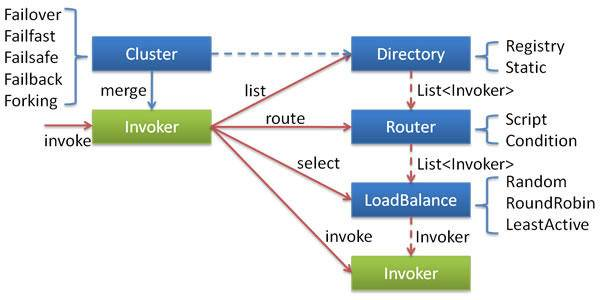

# 10 | Dubbo框架里的微服务组件

经过前面几期的讲解，你应该已经对微服务的架构有了初步的了解。简单回顾一下，微服务的架构主要包括服务描述、服务发现、服务调用、服务监控、服务追踪以及服务治理这几个基本组件。

那么每个基本组件从架构和代码设计上该如何实现？组件之间又是如何串联来实现一个完整的微服务架构呢？<b>今天我就以开源微服务框架 Dubbo 为例来给你具体讲解这些组件</b>。

## 服务发布与引用

专栏前面我讲过服务发布与引用的三种常用方式：RESTful API、XML 配置以及 IDL 文件，其中 Dubbo 框架主要是使用 XML 配置方式，接下来我通过具体实例，来给你讲讲 Dubbo 框架服务发布与引用是如何实现的。

首先来看服务发布的过程，下面这段代码是服务提供者的 XML 配置。

```xml
<?xml version="1.0" encoding="UTF-8"?>
<beans xmlns="http://www.springframework.org/schema/beans"      
       xmlns:xsi="http://www.w3.org/2001/XMLSchema-instance"    
       xmlns:dubbo="http://dubbo.apache.org/schema/dubbo"    
       xsi:schemaLocation="http://www.springframework.org/schema/beans
                           http://www.springframework.org/schema/beans/spring-beans-4.3.xsd
                           http://dubbo.apache.org/schema/dubbo
                           http://dubbo.apache.org/schema/dubbo/dubbo.xsd">
    <!-- 提供方应用信息，用于计算依赖关系 -->
    <dubbo:application name="hello-world-app" />

    <!-- 使用multicast广播注册中心暴露服务地址 -->
    <dubbo:registry address="multicast://224.5.6.7:1234" /> 

    <!-- 用dubbo协议在20880端口暴露服务 -->
    <dubbo:protocol name="dubbo" port="20880" />
    
    <!-- 声明需要暴露的服务接口 -->
    <dubbo:service interface="com.alibaba.dubbo.demo.DemoService" ref="demoService" />
    
    <!-- 和本地bean一样实现服务 -->
    <bean id="demoService" class="com.alibaba.dubbo.demo.provider.DemoServiceImpl" />
</beans>
```

其中“dubbo:service”开头的配置项声明了服务提供者要发布的接口，“dubbo:protocol”开头的配置项声明了服务提供者要发布的接口的协议以及端口号。

Dubbo 会把以上配置项解析成下面的 URL 格式：

<pre>
dubbo://host-ip:20880/com.alibaba.dubbo.demo.DemoService
</pre>

然后基于[扩展点自适应机制](http://dubbo.apache.org/zh-cn/docs/dev/SPI.html)，通过 URL 的“dubbo://”协议头识别，就会调用 DubboProtocol 的 export() 方法，打开服务端口 20880，就可以把服务 demoService 暴露到 20880 端口了。

再来看下服务引用的过程，下面这段代码是服务消费者的 XML 配置。

```xml
<?xml version="1.0" encoding="UTF-8"?>
<beans xmlns="http://www.springframework.org/schema/beans"
       xmlns:xsi="http://www.w3.org/2001/XMLSchema-instance"
       xmlns:dubbo="http://dubbo.apache.org/schema/dubbo"
       xsi:schemaLocation="http://www.springframework.org/schema/beans
                           http://www.springframework.org/schema/beans/spring-beans-4.3.xsd
                           http://dubbo.apache.org/schema/dubbo
                           http://dubbo.apache.org/schema/dubbo/dubbo.xsd">
    <!-- 消费方应用名，用于计算依赖关系，不是匹配条件，不要与提供方一样 -->
    <dubbo:application name="consumer-of-helloworld-app" />
    
    <!-- 使用multicast广播注册中心暴露发现服务地址 -->
    <dubbo:registry address="multicast://224.5.6.7:1234" />
    
    <!-- 生成远程服务代理，可以和本地bean一样使用demoService -->
    <dubbo:reference id="demoService" interface="com.alibaba.dubbo.demo.DemoService" />
</beans>
```

其中“dubbo:reference”开头的配置项声明了服务消费者要引用的服务，Dubbo 会把以上配置项解析成下面的 URL 格式：

<pre>
dubbo://com.alibaba.dubbo.demo.DemoService
</pre>

然后基于扩展点自适应机制，通过 URL 的“dubbo://”协议头识别，就会调用 DubboProtocol 的 refer() 方法，得到服务 demoService 引用，完成服务引用过程。

## 服务注册与发现

先来看下服务提供者注册服务的过程，继续以前面服务提供者的 XML 配置为例，其中“dubbo://registry”开头的配置项声明了注册中心的地址，Dubbo 会把以上配置项解析成下面的 URL 格式：

<pre>
registry://multicast://224.5.6.7:1234/com.alibaba.dubbo.registry.RegistryService?export=URL.encode("dubbo://host-ip:20880/com.alibaba.dubbo.demo.DemoService")
</pre>

然后基于扩展点自适应机制，通过 URL 的“registry://”协议头识别，就会调用 RegistryProtocol 的 export() 方法，将 export 参数中的提供者 URL，注册到注册中心。

再来看下服务消费者发现服务的过程，同样以前面服务消费者的 XML 配置为例，其中“dubbo://registry”开头的配置项声明了注册中心的地址，跟服务注册的原理类似，Dubbo 也会把以上配置项解析成下面的 URL 格式：

<pre>
registry://multicast://224.5.6.7:1234/com.alibaba.dubbo.registry.RegistryService?refer=URL.encode("consummer://host-ip/com.alibaba.dubbo.demo.DemoService")
</pre>

## 服务调用

专栏前面我讲过在服务调用的过程中，通常把服务消费者叫作客户端，服务提供者叫作服务端，发起一次服务调用需要解决四个问题：
- 客户端和服务端如何建立网络连接？
- 服务端如何处理请求？
- 数据传输采用什么协议？
- 数据该如何序列化和反序列化？

其中前两个问题客户端和服务端如何建立连接和服务端如何处理请求是通信框架要解决的问题，Dubbo 支持多种通信框架，比如 Netty  4，需要在服务端和客户端的 XML 配置中添加下面的配置项。

服务端：

<pre>
<dubbo:protocol server="netty4" />
</pre>

客户端：

<pre>
<dubbo:consumer client="netty4" />
</pre>

再来看下 Dubbo 的数据传输采用什么协议。Dubbo 不仅支持私有的 Dubbo 协议，还支持其他协议比如 Hessian、RMI、HTTP、Web Service、Thrift 等。下面这张图描述了私有 Dubbo 协议的协议头约定。


至于数据序列化和反序列方面，Dubbo 同样也支持多种序列化格式，比如 Dubbo、Hession  2.0、JSON、Java、Kryo 以及 FST 等，可以通过在 XML 配置中添加下面的配置项。

<pre>
<dubbo:protocol name="dubbo" serialization="kryo"/>
</pre>

## 服务监控

服务监控主要包括四个流程：数据采集、数据传输、数据处理和数据展示，其中服务框架的作用是进行埋点数据采集，然后上报给监控系统。

在 Dubbo 框架中，无论是服务提供者还是服务消费者，在执行服务调用的时候，都会经过 Filter 调用链拦截，来完成一些特定功能，比如监控数据埋点就是通过在 Filter 调用链上装备了 MonitorFilter 来实现的，详细的代码实现你可以参考[这里](https://github.com/apache/dubbo/blob/7a48fac84b14ac6a21c1bdfc5958705dd8dda84d/dubbo-monitor/dubbo-monitor-api/src/main/java/org/apache/dubbo/monitor/support/MonitorFilter.java)。

## 服务治理

服务治理手段包括节点管理、负载均衡、服务路由、服务容错等，下面这张图给出了 Dubbo 框架服务治理的具体实现。



图中的 Invoker 是对服务提供者节点的抽象，Invoker 封装了服务提供者的地址以及接口信息。
- 节点管理：Directory 负责从注册中心获取服务节点列表，并封装成多个 Invoker，可以把它看成“List<Invoker>” ，它的值可能是动态变化的，比如注册中心推送变更时需要更新。
- 负载均衡：LoadBalance 负责从多个 Invoker 中选出某一个用于发起调用，选择时可以采用多种负载均衡算法，比如 Random、RoundRobin、LeastActive 等。
- 服务路由：Router 负责从多个 Invoker 中按路由规则选出子集，比如读写分离、机房隔离等。
- 服务容错：Cluster 将 Directory 中的多个 Invoker 伪装成一个 Invoker，对上层透明，伪装过程包含了容错逻辑，比如采用 Failover 策略的话，调用失败后，会选择另一个 Invoker，重试请求。

## 一次服务调用的流程

上面我讲的是 Dubbo 下每个基本组件的实现方式，那么 Dubbo 框架下，一次服务调用的流程是什么样的呢？下面结合这张图，我来给你详细讲解一下。


首先我来解释微服务架构中各个组件分别对应到上面这张图中是如何实现。
- 服务发布与引用：对应实现是图里的 Proxy 服务代理层，Proxy 根据客户端和服务端的接口描述，生成接口对应的客户端和服务端的 Stub，使得客户端调用服务端就像本地调用一样。
- 服务注册与发现：对应实现是图里的 Registry 注册中心层，Registry 根据客户端和服务端的接口描述，解析成服务的 URL 格式，然后调用注册中心的 API，完成服务的注册和发现。
- 服务调用：对应实现是 Protocol 远程调用层，Protocol 把客户端的本地请求转换成 RPC 请求。然后通过 Transporter 层来实现通信，Codec 层来实现协议封装，Serialization 层来实现数据序列化和反序列化。
- 服务监控：对应实现层是 Filter 调用链层，通过在 Filter 调用链层中加入 MonitorFilter，实现对每一次调用的拦截，在调用前后进行埋点数据采集，上传给监控系统。
- 服务治理：对应实现层是 Cluster 层，负责服务节点管理、负载均衡、服务路由以及服务容错。

再来看下微服务架构各个组件是如何串联起来组成一个完整的微服务框架的，以 Dubbo 框架下一次服务调用的过程为例，先来看下客户端发起调用的过程。
- 首先根据接口定义，通过 Proxy 层封装好的透明化接口代理，发起调用。
- 然后在通过 Registry 层封装好的服务发现功能，获取所有可用的服务提供者节点列表。
- 再根据 Cluster 层的负载均衡算法从可用的服务节点列表中选取一个节点发起服务调用，如果调用失败，根据 Cluster 层提供的服务容错手段进行处理。
- 同时通过 Filter 层拦截调用，实现客户端的监控统计。
- 最后在 Protocol 层，封装成 Dubbo RPC 请求，发给服务端节点。

这样的话，客户端的请求就从一个本地调用转化成一个远程 RPC 调用，经过服务调用框架的处理，通过网络传输到达服务端。其中服务调用框架包括通信协框架 Transporter、通信协议 Codec、序列化 Serialization 三层处理。

服务端从网络中接收到请求后的处理过程是这样的：
- 首先在 Protocol 层，把网络上的请求解析成 Dubbo RPC 请求。
- 然后通过 Filter 拦截调用，实现服务端的监控统计。
- 最后通过 Proxy 层的处理，把 Dubbo RPC 请求转化为接口的具体实现，执行调用。

## 总结

今天我给你讲述了 Dubbo 服务化框架每个基本组件的实现方式，以及一次 Dubbo 调用的流程。

<b>对于学习微服务架构来说，最好的方式是去实际搭建一个微服务的框架，甚至去从代码入手做一些二次开发</b>。

你可以按照 Dubbo 的[官方文档](http://dubbo.apache.org/en-us/)去安装并搭建一个服务化框架。如果想深入了解它的实现的话，可以下载[源码](https://github.com/apache/dubbo)来阅读。

## 思考题

在以 Dubbo 为例，学习完服务化框架的具体实现后，你对其中的实现细节还有什么疑问吗？