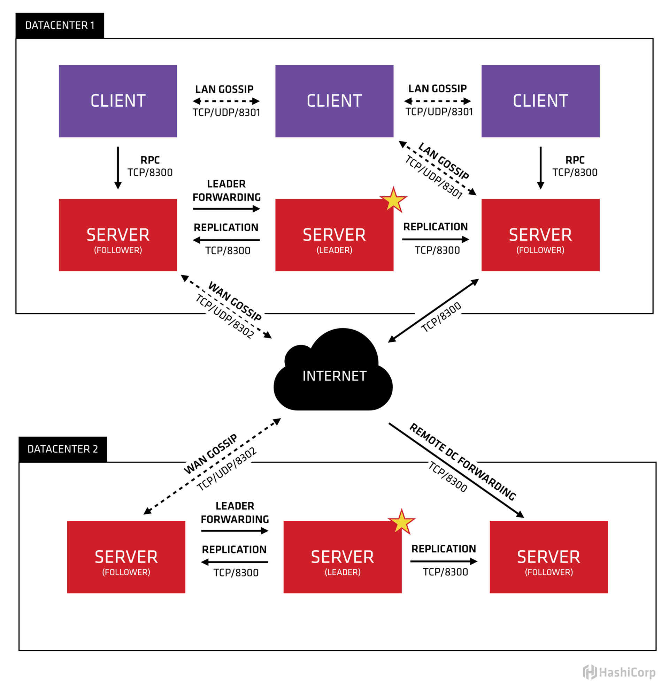

# 13 | 开源服务注册中心如何选型？

上一期我给你讲了服务注册中心的落地实践，以及在实际应用中可能会遇到的问题和对应的解决方案。关于注册中心，如果你的团队有足够的人才和技术储备，可以选择自己研发注册中心。但对于大多数中小规模团队来说，我的建议是最好使用业界开源的、应用比较成熟的注册中心解决方案，把精力投入到业务架构的改造中，不要自己造轮子。

当下主流的服务注册与发现的解决方案，主要有两种：
- 应用内注册与发现：注册中心提供服务端和客户端的 SDK，业务应用通过引入注册中心提供的 SDK，通过 SDK 与注册中心交互，来实现服务的注册和发现。
- 应用外注册与发现：业务应用本身不需要通过 SDK 与注册中心打交道，而是通过其他方式与注册中心交互，间接完成服务注册与发现。

<b>下面我会用两个业界使用比较成熟的注册中心开源实现，来讲解下应用内和应用外两种解决方案的不同之处。</b>

## 两种典型的注册中心实现

### 1. 应用内

采用应用内注册与发现的方式，最典型的案例要属 Netflix 开源的 Eureka，官方架构图如下。

对着这张图，我来介绍下 Eureka 的架构，它主要由三个重要的组件组成：
- Eureka Server：注册中心的服务端，实现了服务信息注册、存储以及查询等功能。
- 服务端的 Eureka Client：集成在服务端的注册中心 SDK，服务提供者通过调用 SDK，实现服务注册、反注册等功能。
- 客户端的 Eureka Client：集成在客户端的注册中心 SDK，服务消费者通过调用 SDK，实现服务订阅、服务更新等功能。

### 2. 应用外

采用应用外方式实现服务注册和发现，最典型的案例是开源注册中心 Consul，它的架构图如下。

通过这张架构图，可以看出来使用 Consul 实现应用外服务注册和发现主要依靠三个重要的组件：
- Consul：注册中心的服务端，实现服务注册信息的存储，并提供注册和发现服务。
- <b>[Registrator](https://github.com/gliderlabs/registrator)</b>：一个开源的第三方服务管理器项目，它通过监听服务部署的 Docker 实例是否存活，来负责服务提供者的注册和销毁。
- <b>[Consul Template](https://github.com/hashicorp/consul-template)</b>：定时从注册中心服务端获取最新的服务提供者节点列表并刷新 LB 配置（比如 Nginx 的 upstream），这样服务消费者就通过访问 Nginx 就可以获取最新的服务提供者信息。

对比小结一下，这两种解决方案的不同之处在于应用场景，应用内的解决方案一般适用于服务提供者和服务消费者同属于一个技术体系；应用外的解决方案一般适合服务提供者和服务消费者采用了不同技术体系的业务场景，比如服务提供者提供的是 C++ 服务，而服务消费者是一个 Java 应用，这时候采用应用外的解决方案就不依赖于具体一个技术体系。同时，对于容器化后的云应用来说，一般不适合采用应用内 SDK 的解决方案，因为这样会侵入业务，而应用外的解决方案正好能够解决这个问题。

## 注册中心选型要考虑的两个问题

在选择注册中心解决方案的时候，除了要考虑是采用应用内注册还是应用外注册的方式以外，还有两个最值得关注的问题，一个是高可用性，一个是数据一致性，下面我来给你详细解释下为什么。

### 1. 高可用性

注册中心作为服务提供者和服务消费者之间沟通的纽带，它的高可用性十分重要。试想，如果注册中心不可用了，那么服务提供者就无法对外暴露自己的服务，而服务消费者也无法知道自己想要调用的服务的具体地址，后果将不堪设想。

根据我过往的实践经验，实现高可用性的方法主要有两种：

- 集群部署，顾名思义就是通过部署多个实例组成集群来保证高可用性，这样的话即使有部分机器宕机，将访问迁移到正常的机器上就可以保证服务的正常访问。
- 多 IDC 部署，就是部署在不止一个机房，这样能保证即使一个机房因为断电或者光缆被挖断等不可抗力因素不可用时，仍然可以通过把请求迁移到其他机房来保证服务的正常访问。

我们以 Consul 为例，来看看它是如何通过这两种方法来保证注册中心的高可用性。

从下面的官方架构图中你可以看到，一方面，在每个数据中心（DATACENTER）内都有多个注册中心 Server 节点可供访问；另一方面还可以部署在多个数据中心来保证多机房高可用性。

### 数据一致性

为了保证注册中心的高可用性，注册中心的部署往往都采用集群部署，并且还通常部署在不止一个数据中心，这样的话就会引出另一个问题，多个数据中心之间如何保证数据一致？如何确保访问数据中心中任何一台机器都能得到正确的数据？

这里就涉及分布式系统中著名的 CAP 理论，即同时满足一致性、可用性、分区容错性这三者是不可能的，其中 C（Consistency）代表一致性，A（Availability）代表可用性，P（Partition Tolerance）代表分区容错性。

为什么说 CAP 三者不能被同时满足的呢？

但是有可能出现网络故障，导致整个网络被分成了互不连通的区域，这就叫作分区。一旦出现分区，那么一个区域内的节点就没法访问其他节点上的数据了，最好的办法是把数据复制到其他区域内的节点，这样即使出现分区，也能访问任意区域内节点上的数据，这就是分区容错性。

但是把数据复制到多个节点就可能出现数据不一致的情况，这就是一致性。要保证一致，就必须等待所有节点上的数据都更新成功才可用，这就是可用性。

总的来说，就是数据节点越多，分区容错性越高，但数据一致性越难保证。为了保证数据一致性，又会带来可用性的问题。

而注册中心一般采用分布式集群部署，也面临着 CAP 的问题，根据 CAP 不能同时满足，所以不同的注册中心解决方案选择的方向也就不同，大致可分为两种。
- CP 型注册中心，牺牲可用性来保证数据强一致性，最典型的例子就是 ZooKeeper，etcd，Consul 了。ZooKeeper 集群内只有一个 Leader，而且在 Leader 无法使用的时候通过 Paxos 算法选举出一个新的 Leader。这个 Leader 的目的就是保证写信息的时候只向这个 Leader 写入，Leader 会同步信息到 Followers，这个过程就可以保证数据的强一致性。但如果多个 ZooKeeper 之间网络出现问题，造成出现多个 Leader，发生脑裂的话，注册中心就不可用了。而 etcd 和 Consul 集群内都是通过 raft 协议来保证强一致性，如果出现脑裂的话， 注册中心也不可用。
- AP 型注册中心，牺牲一致性来保证可用性，最典型的例子就是 Eureka 了。对比下 Zookeeper，Eureka 不用选举一个 Leader，每个 Eureka 服务器单独保存服务注册地址，因此有可能出现数据信息不一致的情况。但是当网络出现问题的时候，每台服务器都可以完成独立的服务。

而对于注册中心来说，最主要的功能是服务的注册和发现，在网络出现问题的时候，可用性的需求要远远高于数据一致性。即使因为数据不一致，注册中心内引入了不可用的服务节点，也可以通过其他措施来避免，比如客户端的快速失败机制等，只要实现最终一致性，对于注册中心来说就足够了。因此，选择 AP 型注册中心，一般更加合适。

## 总结

总的来说，在选择开源注册中心解决方案的时候，要看业务的具体场景。
- 如果你的业务体系都采用 Java 语言的话，Netflix 开源的 Eureka 是一个不错的选择，并且它作为服务注册与发现解决方案，能够最大程度的保证可用性，即使出现了网络问题导致不同节点间数据不一致，你仍然能够访问 Eureka 获取数据。
- 如果你的业务体系语言比较复杂，Eureka 也提供了 Sidecar 的解决方案；也可以考虑使用 Consul，它支持了多种语言接入，包括 Go、Python、PHP、Scala、Java，Erlang、Ruby、Node.js、.NET、Perl 等。
- 如果你的业务已经是云原生的应用，可以考虑使用 Consul，搭配 Registrator 和 Consul Template 来实现应用外的服务注册与发现。

## 思考题

针对你的业务场景，如果要选择一种开源注册中心实现的话，你觉得哪种方案更适合？