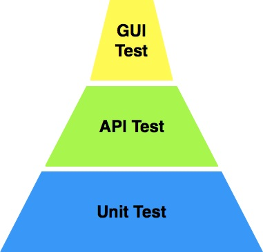
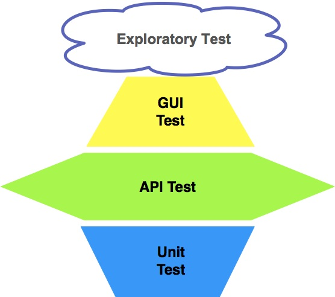

# 互联网产品的测试策略应该如何设计？

在上一篇文章中，我跟你分享了做好互联网产品测试你要具备的非测试知识，那么现在我就来跟你聊聊应该如何设计互联网产品的测试策略。

在我开始今天的话题之前，请你先思考一下为什么我会把互联网产品的测试策略单独拿出来讨论，互联网产品的测试策略和传统软件产品的测试策略到底有哪些不同？

## 研发流程的不同决定了测试策略的不同

如果直接回答互联网产品和传统软件产品的测试策略有何不同，你会有些摸不着头脑，那么按照我一直在强调的知其然知其所以然的原则，你可以先去总结这两类产品的研发本身最大的不同是什么？

<b>那就是，互联网产品的“快”。</b>

我在专栏前面的文章中，已经提到了互联网产品的上线周期通常是以“天”甚至是以“小时”为单位，而传统软件产品的周期多以“月”，甚至以“年”为单位。

<b>发布周期的巨大差异决定了，传统软件产品的测试策略必然不适用于互联网产品的测试，二者的测试策略必然在测试执行时间和测试执行环境上有巨大差异。</b>

比如，对于功能自动化测试用例，执行一轮全回归测试需要 12 小时，对传统软件来说这根本不是问题，因为发布周期很长，留给测试的时间也会很充裕。

不要说全回归测试执行时间需要12小时，哪怕是需要几天几夜也没有任何问题，就像我以前在思科（Cisco）做传统软件测试时，一轮完整的全回归测试的 GUI 测试用例数接近 3000 个，API 测试用例数更是接近 25000 个，跑完全部用例需要将近 60 小时。

但对互联网产品来说，通常24小时就会有一到两次的发布，发布流程通常包含了代码静态扫描、单元测试、编译、打包、上传、下载、部署和测试的全流程。显然留给测试执行的时间就非常有限，传统软件动辄十几个小时的测试执行时间，在互联网产品的测试上，根本行不通。

<b>通常情况下，互联网产品要求全回归测试的执行时间不能超过4小时。</b>

那么，如何在保证测试质量和测试覆盖率的前提下，有效缩短测试执行时间呢？
- 首先，你可以引入测试的并发执行机制，用包含大量测试执行节点的测试执行集群来并发执行测试用例。
  测试执行集群，你可以简单理解为是一批专门用来并发执行测试用例的机器。常见的测试执行集群，由一个主节点（Master）和若干个子节点（Node）组成。其中，主节点用来分发测试用例到各个子节点，而各个子节点用来具体执行测试用例。 
  目前，很多互联网企业都建立了自己的测试执行集群。
- 其次，你必须从测试策略上找到突破口，这也是我今天跟你分享的主题。 
  接下来，我会先简单为你介绍一下传统软件产品的测试策略设计，然后再给你分享互联网产品的测试策略，这样可以通过对传统软件产品测试策略的回顾，加深你对互联网产品测试策略的认识。

## 传统软件产品的测试策略设计

传统软件产品的测试策略，通常采用如图 1 所示的金字塔模型。该金字塔模型是迈克 · 科恩（Mike Cohn）提出的，在很长一段时间内都被认为是测试策略设计的最佳实践。

图1传统软件产品的金字塔测试策略

### 第一，单元测试

金字塔最底部是单元测试，属于白盒测试的范畴，通常由开发工程师自己完成，由于越早发现缺陷其修复成本越低，所以传统软件产品的测试策略提倡对单元测试的高投入，单元测试这一层通常都会做得比较“厚”。

另外，传统软件产品，生命周期都比较长，通常会有多个版本持续发布，为了在后期的版本升级过程中能够尽早发现并快速定位问题，每次 build 过程中都会多次反复执行单元测试，这也从另一个角度反映出单元测试的重要性。

### 第二，API 测试

<b>金字塔中间部分是 API 测试，主要针对的是各模块暴露的接口，通常采用灰盒测试方法。灰盒测试方法是介于白盒测试和黑盒测试之间的一种测试技术，其核心思想是利用测试执行的代码覆盖率来指导测试用例的设计。</b>

以 API 接口测试为例，首先以黑盒方式设计如何调用 API 的测试用例，同时在测试执行过程中统计代码覆盖率，然后根据代码覆盖率情况来补充更多、更有针对性的测试用例。

总体来看，API 测试用例的数量会少于单元测试，但多于上层的 GUI 测试。

### 第三，GUI 测试

金字塔最上层的是 GUI 测试，也称为端到端（E2E，End-to-end）测试，是最接近软件真实用户使用行为的测试类型。通常是模拟真实用户使用软件的行为，即模拟用户在软件界面上的各种操作，并验证这些操作对应的结果是否正确。

GUI 测试的优点是，能够实际模拟真实用户的行为，直接验证软件的商业价值；缺点是执行的代价比较大，就算是采用 GUI 自动化测试技术，用例的维护和执行代价依然很大。所以，要尽可能地避免对 GUI 测试的过度依赖。

另外，GUI 测试的稳定性问题，是长期以来阻碍 GUI 测试发展的重要原因。即使你采用了很多诸如 retry 机制以及异常场景恢复机制等方式，GUI 测试的随机失败率依旧高居不下。

## 互联网产品的测试策略设计

对于互联网产品来说，迈克的金字塔模型已经不再适用，我会通过 GUI 测试、API 测试、单元测试这三个方面，来跟你聊聊互联网产品的测试策略有哪些变化，应该如何设计。

### 第一，GUI 测试

互联网产品的上线周期，决定了 GUI 测试不可能大范围开展。
1. 互联网产品的迭代周期，决定了留给开发 GUI 自动化测试用例的时间非常有限；
2. 互联网产品客户端界面的频繁变化，决定了开展 GUI 自动化测试的效率会非常低，这也是最糟糕的。 
   因为敏捷模式下的快速反馈，在下一个迭代（sprint）可能就需要根据反馈来做修改和调整客户端界面，那么刚开发完，甚至是还没开发完的 GUI 自动化测试用例就要跟着一起修改。 
   这种频繁地修改，对开发 GUI 自动化测试是非常不利的。因为，刚开发完的自动化用例只跑了一次，甚至是一次还没来得及跑就需要更新了，导致 GUI 自动化测试还不如手工测试的效率高。

由此，<b>互联网产品的 GUI 测试通常采用“手工为主，自动化为辅”的测试策略，手工测试往往利用探索性测试思想，针对新开发或者新修改的界面功能进行测试，而自动化测试的关注点主要放在相对稳定且核心业务的基本功能验证上。所以，GUI 的自动化测试往往只覆盖最核心且直接影响主营业务流程的 E2E 场景。</b>

另外，从 GUI 测试用例的数量来看，传统软件的 GUI 测试属于重量级的，动不动就有上千个用例，因为传统软件的测试周期很长，测试用例可以轮流排队慢慢执行，时间长点也没关系。

而互联网产品要求 GUI 测试是轻量级的，你见过或者听过有哪个互联网产品设计了上千个 GUI 测试用例吗？互联网产品的上线周期，直接决定了不允许你去执行大量的用例。

### 第二，API 测试

你现在可能要问，既然互联网产品不适宜做重量级的 GUI 测试，那么怎样才能保证其质量呢？

其实，对于互联网产品来说，把测试重点放在 API 测试上，才是最明智的选择。为什么呢？我给你总结了以下五条原因。
1. <b>API 测试用例的开发与调试效率比 GUI 测试要高得多</b>，而且测试用例的代码实现比较规范，通常就是准备测试数据，发起 request，验证 response 这几个标准步骤。
2. <b>API 测试用例的执行稳定性远远高于 GUI 测试。</b> GUI 测试执行的稳定性始终是难题，即使你采用了很多技术手段（这些具体的技术手段，我会在讲解 GUI 测试时再详细展开），它也无法做到 100% 的稳定。 而 API 测试天生就没有执行稳定性的问题，因为测试执行过程不依赖于任何界面上的操作，而是直接调用后端 API，且调用过程比较标准。
3. 单个 API 测试用例的执行时间往往要比 GUI 测试短很多。当有大量 API 测试需要执行时，API 测试可以很方便地以并发的方式执行，所以可以在短时间内完成大批量 API 测试用例的执行。
4. 现在很多互联网产品采用了微服务架构，而对微服务的测试，本质上就是对不同的 Web Service 的测试，也就是 API 测试。 
   在微服务架构下，客户端应用的实现都是基于对后端微服务的调用，如果做好了每个后端服务的测试，你就会对应用的整体质量有充分的信心。所以，互联网产品的 API 测试非常重要。
5. API 接口的改动一般比较少，即使有改动，绝大多数情况下也需要保证后向兼容性（Backward Compatibility）。所谓后向兼容性，最基本的要求就是保证原本的 API 调用方式维持不变。 
   显然，如果调用方式没有发生变化，那么原本的 API 测试用例也就不需要做大的改动，这样用例的可重用性就很高，进而可以保证较高的投入产出比（ROI）。

可见，<b>互联网产品的这些特性决定了，API 测试可以实现良好的投入产出比，因此应该成为互联网产品的测试重点。这也就是为什么互联网产品的测试策略更像是个菱形结构的原因。</b>

如图2所示就是这个菱形的测试策略，遵循“<b>重量级 API 测试，轻量级 GUI 测试，轻量级单元测试</b>”的原则。

图2互联网产品的菱形测试策略

### 第三，单元测试

了解了“重量级 API 测试”和“轻量级 GUI 测试”，接下来，我就跟你说说为什么是“轻量级单元测试”。

从理论上讲，无论是传统软件产品还是互联网产品，单元测试都是从源头保证软件质量的重要手段，因此都非常重要。但现实是，互联网产品真正能全面开展单元测试，并严格控制代码覆盖率的企业还是凤毛麟角。

但凡存在的都会有其合理性，我认为最主要的原因还是在于互联网产品的“快”，快速实现功能，快速寻求用户反馈，快速试错，快速迭代更新。

在这样的模式下，互联网产品追求的是最快速的功能实现并上线，基本不会给你时间去做全面的单元测试。即使给你预留了单元测试的时间，频繁的迭代也会让单元测试处于不断重写的状态。因此，单元测试原本的价值，很难在实际操作层面得到体现。

<b>那么，互联网产品真的可以不用做单元测试么？答案是否定的，只不是这里的单元测试策略要采用“分而治之”的思想。</b>

互联网产品通常会分为应用层和后端服务，后端服务又可以进一步细分为应用服务和基础服务。

后端基础服务和一些公共应用服务相对稳定，而且对于系统全局来说是“牵一发而动全身”，所以后端服务很有必要开展全面的单元测试；而对于变动非常频繁的客户端应用和非公用的后端应用服务，一般很少会去做单元测试。

另外，对于一些核心算法和关键应用，比如银行网关接口，第三方支付集成接口等，也要做比较全面的单元测试。

<b>总结来讲，互联网产品的全面单元测试只会应用在那些相对稳定和最核心的模块和服务上，而应用层或者上层业务服务很少会大规模开展单元测试。</b>

## 总结

传统软件通常采用金字塔模型的测试策略，而现今的互联网产品往往采用菱形模型。菱形模型有以下四个关键点：
- 以中间层的 API 测试为重点做全面的测试。
- 轻量级的 GUI 测试，只覆盖最核心直接影响主营业务流程的 E2E 场景。
- 最上层的 GUI 测试通常利用探索式测试思维，以人工测试的方式发现尽可能多的潜在问题。
- 单元测试采用“分而治之”的思想，只对那些相对稳定并且核心的服务和模块开展全面的单元测试，而应用层或者上层业务只会做少量的单元测试。

## 思考题

你所在的公司或者产品线，采用的是什么测试策略？看完了本篇文章，你会如何评价你们公司的测试策略呢？有哪些好的地方，又有哪些地方需要改进？