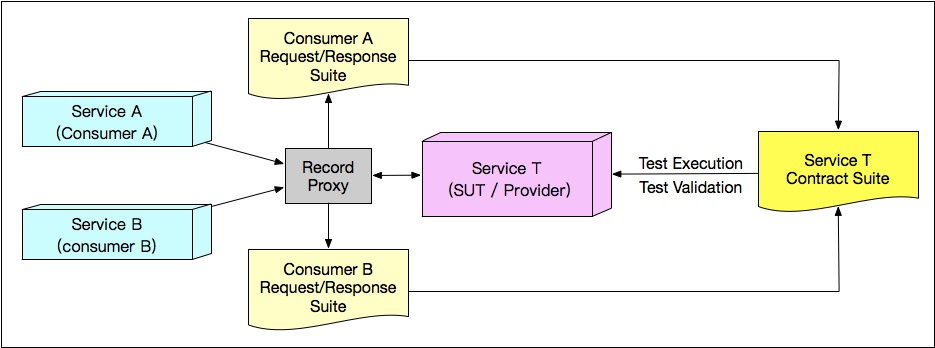
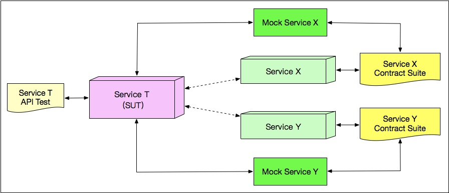
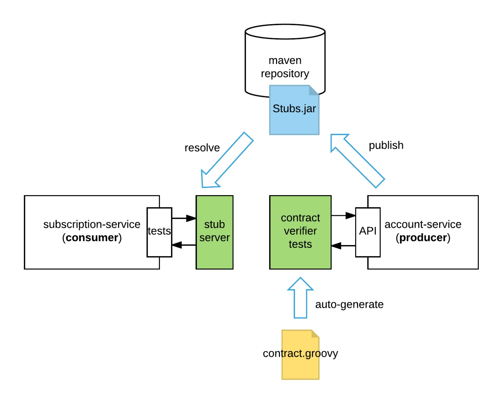

# 紧跟时代步伐：微服务模式下API测试要怎么做？

通过一个的 Restful API 实例，我介绍了 cURL 和 Postman 工具的基本用法，这样我们对 API 测试有了一个感性认识；在此基础上，我介绍了 API 自动化测试框架发展的来龙去脉，借此我们对 API 测试框架的理解又更深入了一层。

今天，我将更进一步，带你去了解当下最热门的技术领域的 API 测试，即微服务模式下的 API 测试。微服务架构下，API 测试的最大挑战来自于庞大的测试用例数量，以及微服务之间的相互耦合。所以，我今天分享这个主题的目的就是，帮你理解这两个问题的本质，以及如何基于消费者契约的方法来应对这两个难题。

而为了掌握微服务模式下的 API 测试，你需要先了解微服务架构（Microservice Architecture）的特点、测试挑战；而要了解微服务架构，你又需要先了解一些单体架构（Monolithic Architecture）的知识。所以，今天的话题我将逐层展开，目的就是希望你可以真正理解，并快速掌握微服务模式下的 API 测试。

## 单体架构（Monolithic Architecture）

单体架构是早期的架构模式，并且存在了很长时间。单体架构是将所有的业务场景的表示层、业务逻辑层和数据访问层放在同一个工程中，最终经过编译、打包，并部署在服务器上。

比如，经典的 J2EE 工程，它就是将表示层的 JSP、业务逻辑层的 Service、Controller 和数据访问层的 DAO（Data Access Objects），打包成 war 文件，然后部署在 Tomcat、Jetty 或者其他 Servlet 容器中运行。

显然单体架构具有发布简单、方便调试、架构复杂性低等优点，所以长期以来一直被大量使用，并广泛应用于传统企业级软件。

但是，随着互联网产品的普及，应用所承载的流量越来越庞大，单体架构的问题也被逐渐暴露并不断放大，主要的问题有以下几点：
- <b>灵活性差</b>：无论是多小的修改，哪怕只修改了一行代码，也要打包发布整个应用。更糟的是，由于所有模块代码都在一起，所以每次编译打包都要花费很长时间。
- <b>可扩展性差</b>：在高并发场景下，无法以模块为单位灵活扩展容量，不利于应用的横向扩展。
- <b>稳定性差</b>：当单体应用中任何一个模块有问题时，都可能会造成应用整体的不可用，缺乏容错机制。
- <b>可维护性差</b>：随着业务复杂性的提升，代码的复杂性也是直线上升，当业务规模比较庞大时，整体项目的可维护性会大打折扣。

正是因为面对互联网应用时，单体架构有这一系列无法逾越的鸿沟，所以催生了微服务架构。

其实，微服务架构也不是一蹴而就的，也经历了很长时间的演化发展，中间还经历了著名的 SOA 架构。但是这个由单体架构到 SOA 架构再到微服务架构的演进过程，并不是本文的重点，所以我就不再详细展开了，如果你感兴趣的话，可以自行去查阅一些相关资料。

## 微服务架构（Microservice Architecture）

微服务是一种架构风格。在微服务架构下，一个大型复杂软件系统不再由一个单体组成，而是由一系列相互独立的微服务组成。其中，各个微服务运行在自己的进程中，开发和部署都没有依赖。

不同服务之间通过一些轻量级交互机制进行通信，例如 RPC、HTTP 等，服务可独立扩展伸缩，每个服务定义了明确的边界，只需要关注并很好地完成一件任务就可以了，不同的服务可以根据业务需求实现的便利性而采用不同的编程语言来实现，由独立的团队来维护。

图 1 就很形象地展示了单体架构和微服务架构之间的差异。

图 1  单体架构 VS 微服务架构

微服务架构具有以下特点：
- 每个服务运行在其独立的进程中，开发采用的技术栈也是独立的；
- 服务间采用轻量级通信机制进行沟通，通常是基于 HTTP 协议的 RESTful API；
- 每个服务都围绕着具体的业务进行构建，并且能够被独立开发、独立部署、独立发布；
- 对运维提出了非常高的要求，促进了 CI/CD 的发展与落地。

## 微服务架构下的测试挑战

由于微服务架构下，一个应用是由很多相互独立的微服务组成，每个微服务都会对外暴露接口，同时这些微服务之间存在级联调用关系，也就是说一个微服务通常还会去调用其他微服务，鉴于以上特点，微服务架构下的测试挑战主要来自于以下两个方面：
1. 过于庞大的测试用例数量；
2. 微服务之间的耦合关系。

接下来，我会针对这两项挑战分别展开，包括它们从何而来，以及如何应对这些挑战，最终完成测试。

### 第一，过于庞大的测试用例数量</b>

在传统的 API 测试中，我们的测试策略通常是：
- 根据被测 API 输入参数的各种组合调用 API，并验证相关结果的正确性；
- 衡量上述测试过程的代码覆盖率；
- 根据代码覆盖率进一步找出遗漏的测试用例；
- 以代码覆盖率达标作为 API 测试成功完成的标志。

这也是单体架构时代主流的 API 测试策略。为了让你更好地理解这种测试策略，我来举一个实际的例子。

假设我们采用单体架构开发了一个系统，这个系统对外提供了 3 个 Restful API 接口，那么我们的测试策略应该是：
- 针对这 3 个 API 接口，分别基于边界值和等价类方法设计测试用例并执行；
- 在测试执行过程中，启用代码覆盖率统计；
- 假设测试完成后代码行覆盖率是 80%，那么我们就需要找到那些还没有被执行到的 20% 的代码行。比如图 2 中代码的第 242 行就是没有被执行到，分析代码逻辑后发现，我们需要构造“expected!=actual”才能覆盖这个未能执行的代码行；
- 最终我们要保证代码覆盖率达到既定的要求，比如行覆盖率达到 100%，完成 API 测试。

图 2  基于代码覆盖率指导测试用例设计的示例

<b>而当我们采用微服务架构时，原本的单体应用会被拆分成多个独立模块，也就是很多个独立的 service，原本单体应用的全局功能将会由这些拆分得到的 API 共同协作完成。</b>

比如，对于上面这个例子，没有微服务化之前，一共有 3 个 API 接口，假定现在采用微服务架构，该系统被拆分成了 10 个独立的 service，如果每个 service 平均对外暴露 3 个 API 接口，那么总共需要测试的 API 接口数量就多达 30 个。

如果我还按照传统的 API 测试策略来测试这些 API，那么测试用例的数量就会非常多，过多的测试用例往往就需要耗费大量的测试执行时间和资源。

但是，在互联网模式下，产品发布的周期往往是以“天”甚至是以“小时”为单位的，留给测试的执行时间非常有限，所以微服务化后 API 测试用例数量的显著增长就对测试发起了巨大的挑战。

这时，我们迫切需要找到一种既能保证 API 质量，又能减少测试用例数量的测试策略，这也就是我接下来要分享的<b>基于消费者契约的 API 测试</b>。

### 第二，微服务之间的耦合关系

微服务化后，服务与服务间的依赖也可能会给测试带来不小的挑战。

如图 3 所示，假定我们的被测对象是 Service T，但是 Service T 的内部又调用了 Service X 和 Service Y。此时，如果 Service X 和 Service Y 由于各种原因处于不可用的状态，那么此时就无法对 Service T 进行完整的测试。

图 3 API 之间的耦合示例

我们迫切需要一种方法可以将 Service T 的测试与 Service X 和 Service Y 解耦。

解耦的方式通常就是实现 Mock Service 来代替被依赖的真实 Service。实现这个 Mock Service 的关键点就是要能够模拟真实 Service 的 Request 和 Response。当我介绍完基于消费者契约的 API 测试后，你会发现这个问题也就迎刃而解了。

## 基于消费者契约的 API 测试

那到底什么是基于消费者契约的 API 测试呢？直接从概念的角度解释，会有些难以理解。所以我打算换个方法来帮助你从本质上真正理解什么是基于消费者契约的 API 测试。接下来，就跟着我的思路走吧。

首先，我们来看图 4，假设图 4 中的 Service A、Service B 和 Service T 是微服务拆分后的三个 Service，其中 Service T 是被测试对象，进一步假定 Service T 的消费者（也就是使用者）一共有两个，分别是 Service A 和 Service B。

图 4  Service A、Service B 和 Service T 的关系

按照传统的 API 测试策略，当我们需要测试 Service T 时，需要找到所有可能的参数组合依次对 Service T 进行调用，同时结合 Service T 的代码覆盖率进一步补充遗漏的测试用例。

这种思路本身没有任何问题，但是测试用例的数量会非常多。那我们就需要思考，如何既能保证 Service T 的质量，又不需要覆盖全部可能的测试用例。

静下心来想一下，你会发现 Service T 的使用者是确定的，只有 Service A 和 Service B，如果可以把 Service A 和 Service B 对 Service T 所有可能的调用方式都测试到，那么就一定可以保证 Service T 的质量。即使存在某些 Service T 的其他调用方式有出错的可能性，那也不会影响整个系统的功能，因为这个系统中并没有其他 Service 会以这种可能出错的方式来调用 Service T。

现在，问题就转化成了如何找到 Service A 和 Service B 对 Service T 所有可能的调用方式。如果能够找出这样的调用集合，并以此作为 Service T 的测试用例，那么只要这些测试用例 100% 通过，Service T 的质量也就不在话下了。

从本质上来讲，这样的测试用例集合其实就是，Service T 可以对外提供的服务的契约，所以我们把这个测试用例的集合称为“基于消费者契约的 API 测试”。

那么接下来，我们要解决的问题就是：如何才能找到 Service A 和 Service B 对 Service T 的所有可能调用了。其实这也很简单，在逻辑结构上，我们只要在 Service T 前放置一个代理，所有进出 Service T 的 Request 和 Response 都会经过这个代理，并被记录成 JSON 文件，也就构成了 Service T 的契约。

如图 5 所示，就是这个过程的原理了。

图 5 收集消费者契约的逻辑原理

在实际项目中，我们不可能在每个 Service 前去放置这样一个代理。但是，微服务架构中往往会存在一个叫作 API Gateway 的组件，用于记录所有 API 之间相互调用关系的日志，我们可以通过解析 API Gateway 的日志分析得到每个 Service 的契约。

至此，我们已经清楚地知道了如何获取 Service 的契约，并由此来构成 Service 的契约测试用例。接下来，就是如何解决微服务之间耦合关系带来的问题了。

## 微服务测试的依赖解耦和 Mock Service

在前面的内容中，我说过一句话：实现 Mock Service 的关键，就是要能够模拟被替代 Service 的 Request 和 Response。

此时我们已经拿到了契约，契约的本质就是 Request 和 Response 的组合，具体的表现形式往往是 JSON 文件，此时我们就可以用该契约的 JSON 文件作为 Mock Service 的依据，也就是在收到什么 Request 的时候应该回复什么 Response。

下面的图 6 就解释了这一关系，当用 Service X 的契约启动 Mock Service X 后，原本真实的 Service X 将被 Mock Service X 替代，也就解耦了服务之间的依赖，图 6 中的 Service Y 也是一样的道理。

图 6 基于 Mock Service 解决 API 之间的调用依赖

## 代码实例

自此，我已经讲完了基于消费者契约的 API 测试的原理，你是否已经都真正理解并掌握了呢？

由于这部分内容的理论知识比较多，为了帮你更好地理解这些概念，我找了一个基于 Spring Cloud Contract 的实际代码的示例演示契约文件格式、消费者契约测试以及微服务之间解耦，希望可以帮到你。

具体的实例代码，你可以从"[https://github.com/SpectoLabs/spring-cloud-contract-blog](https://github.com/SpectoLabs/spring-cloud-contract-blog)"下载，详细的代码解读可以参考"[https://specto.io/blog/2016/11/16/spring-cloud-contract/](https://specto.io/blog/2016/11/16/spring-cloud-contract/)"。

这个实例代码，基于 Spring Boot 实现了两个微服务：订阅服务（subscription-service）和账户服务（account-service），其中订阅服务会调用账户服务。这个实例基于 Spring Cloud Contract，所以契约是通过 Groovy 语言描述的，也就是说实例中会通过 Groovy 语言描述的账户服务契约来模拟真实的账户服务。

这个实例的逻辑关系如图 7 所示。

图 7 基于 Spring Cloud Contract 的契约测试实例

## 总结

单体架构，具有灵活性差、可扩展性差、可维护性差等局限性，所以有了微服务架构。

微服务架构的本身的特点，比如微服务数量多，各个微服务之间的相互调用，决定了不能继续采用传统 API 测试的策略。

为了既能保证 API 质量，又能减少测试用例数量，于是有了基于消费者契约的 API 测试。基于消费者契约的 API 测试的核心思想是：只测试那些真正被实际使用到的 API 调用，如果没有被使用到的，就不去测试。

基于消费者契约的测试方法，由于收集到了完整的契约，所以基于契约的 Mock Service 完美地解决了 API 之间相互依赖耦合的问题。

这已经是 API 自动化测试系列的最后一篇文章了，短短的三篇文章可能让你感觉意犹未尽，也可能感觉并没有涵盖到你在实际工程项目中遇到的 API 测试的所有问题，但是一个专栏区区几十篇文章的确无法面面俱到。

我通过这个专栏更想达到的目的是：讲清楚某一技术的来龙去脉及其应用场景，但是很多具体操作级别、代码实现级别的内容，还是需要你在实践中不断积累。

所以，如果你还有关于 API 测试的其他问题，非常欢迎你给我留言讨论，让我们一起来碰撞出思想火花吧！

## 思考题

基于消费者契约的 API 测试中，对于那些新开发的 API，或者加了新功能的 API，由于之前都没有实际的消费者，所以你无法通过 API Gateway 方法得到契约。对于这种情况，你会采用什么方法来解决呢？