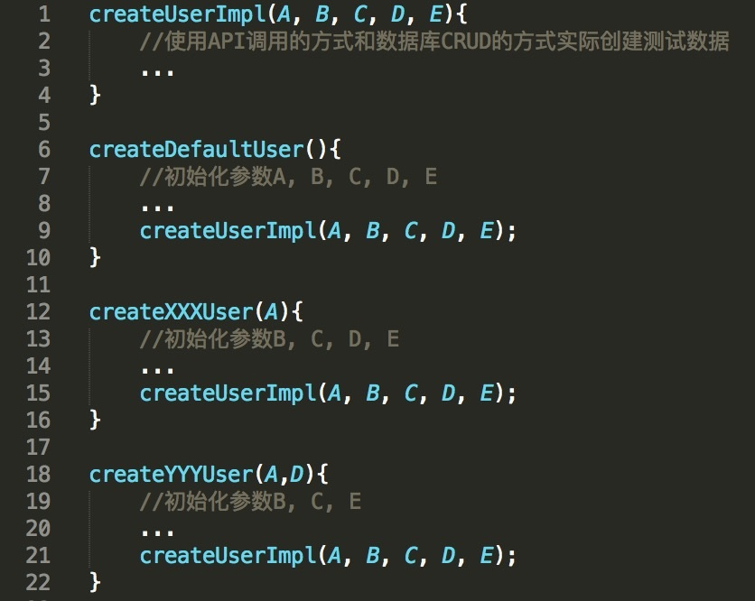

# 测试数据的“银弹”- 统一测试数据平台（上）

在《如何准备测试数据？》和《浅谈测试数据的痛点》这两篇文章中，我介绍了创建测试数据的主要方法，以及创建测试数据的时机。在此基础上，今天我将和你聊聊全球大型电商企业中关于准备测试数据的最佳实践。

这个主题，我会从全球大型电商企业早期的测试数据准备实践谈起，和你一起分析这些测试数据准备方法在落地时遇到的问题，以及如何在实践中解决这些问题。其实，这种分析问题、解决问题的思路，也是推动着测试数据准备时代从 1.0 到 2.0 再到 3.0 演进的原因。

所以，在这个过程中，你可以跟着时代的演进，理解测试数据准备技术与架构的发展历程，并进一步掌握 3.0 时代出现的业内处于领先地位的“统一测试数据平台”的设计思路。

因为这个主题的内容相对较多，为了降低你的学习负担、便于理解消化，我把它分成了两篇文章。同时，为了和你深入地讨论这个话题，也可以真正做到“接地气儿”，我会在这两篇文章中列举很多工程中的实际问题，并给出相应的解决方案。或许这些问题你也曾经遇到过，或者正在被其折磨，希望我给出的这些方案，可以给你启发，帮你攻克这些难关。

我们就先从数据准备的 1.0 时代谈起吧。

## 测试数据准备的 1.0 时代

其实，据我观察，目前很多软件企业还都处于测试数据准备的 1.0 时代。

<b>这个阶段最典型的方法就是，将测试数据准备的相关操作封装成数据准备函数</b>。这些相关操作，既可以是基于 API 的，也可以是基于数据库的，当然也可以两者相结合。

有了这些数据准备函数后，你就可以在测试用例内部以 On-the-fly 的方式调用它们实时创建数据，也可以在测试开始之前，在准备测试环境的阶段以 Out-of-box 的方式调用它们事先创建好测试数据。

那么，一个典型的数据准备函数长什么样子呢？我们一起来看看这段代码吧，里面的 createUser 函数，就是一个典型的数据准备函数了。

```java
public static User createUser(String userName, String password, UserType userType, PaymentDetail paymentDetail, Country country, boolean enable2FA)
{
 // 使用 API 调用的方式和数据库 CRUD 的方式实际创建测试数据 
 ...
}
```

乍一看，你可能觉得，如果可以将大多数的业务数据创建都封装成这样的数据准备函数，那么测试数据的准备过程就变成了调用这些函数，而无需关心数据生成的细节，这岂不是很简单、直观嘛。

但，真的是这样吗？

这里，我建议你在继续阅读后面的内容之前，先思考一下这个方法会有什么短板，然后再回过头来看答案，这将有助于加深你对这个问题的理解。当然，如果你已经在项目中实际采用了这个方法的话，相信你已经对它的短板了如指掌了。

好了，现在我来回答这个问题。<b>利用这种数据准备函数创建测试数据方法的最大短板，在于其参数非常多、也非常复杂</b>。在上面这段代码中，createUser 函数的参数有 6 个。而实际项目中，由于测试数据本身的复杂性、灵活性，参数的数量往往会更多，十多个都是很常见的。

而在调用数据准备函数之前，你首先要做的就是准备好这些参数。如果这些参数的数据类型是基本类型的话，还比较简单（比如，createUser 函数中 userName、password 是字符串型，enable2FA 是布尔型），但这些参数如果是对象（比如，createUser 函数的 userType、paymentDetail 和 Country 就是对象类型的参数）的话，就很麻烦了。为什么呢？

因为，你需要先创建这些对象。更糟糕的是，如果这些对象的初始化参数也是对象的话，就牵连出了一连串的数据创建操作。

下面这段代码，就是使用 createUser 函数创建测试数据的一个典型代码片段。

```java
// 准备 createUser 的参数
UserType userType = new UserType("buyer");
Country country = new Country("US");

// 准备 createPaymentDetail 的参数
PaymentType paymentType = new PaymentType("Paypal");
// 调用 createPaymentDetail 创建 paymentDetail 对象
PaymentDetail paymentDetail = createPaymentDetail(paymentType，2000);

// 对主要的部分，调用 createUser 产生用户数据
User user=createUser(“TestUser001”, “abcdefg1234”, userType, paymentDetail, country, true)；
```

由此可见，每次使用数据准备函数创建数据时，你都要知道待创建数据的全部参数细节，而且还要为此创建这些参数的对象，这就让原本看似简单的、通过数据准备函数调用生成测试数据的过程变得非常复杂。

那么，你可能会问，这个过程是必须的吗，可以用个某些技术手段“跳过”这个步骤吗？

<b>其实，绝大多数的测试数据准备场景是，你仅仅需要一个所有参数都使用了缺省值的测试数据，或者只对个别几个参数有明确的要求，而其他参数都可以是缺省值的测试数据。</b>

以用户数据创建为例，大多情况下你只是需要一个具有缺省（Default）参数的用户，或者是对个别参数有要求的用户。比如，你需要一个美国的用户，或者需要一个 userType 是 buyer 的用户。这时，让你去人为指定所有你并不关心的参数的做法，其实是不合理的，也没有必要。

为了解决这个问题，在工程实践中，就引入了如图 1 所示的封装数据准备函数的形式。



图 1 数据准备函数的封装

在这个封装中，我们将实际完成数据创建的函数命名为 createUserImpl，这个函数内部将通过 API 调用和数据库 CRUD 操作的方式，完成实际数据的创建工作，同时对外暴露了所有可能用到的 user 参数 A、B、C、D、E。

接着，我们封装了一个不带任何参数的 createDefaultUser 函数。函数内部的实现，首先会用默认值初始化 user 的参数 A、B、C、D、E，然后再将这些参数作为调用 createUserImpl 函数时的参数。

那么，<b>当测试用例中仅仅需要一个没有特定要求的默认用户时</b>，你就可以直接调用这个 createDefaultUser 函数，隐藏测试用例并不关心的其他参数的细节，此时也就真正做到了用一行代码生成你想要的测试数据。

<b>而对于那些测试用例只对个别参数有要求的场景</b>，比如只对参数 A 有要求的场景，我们就可以为此封装一个 createXXXUser(A) 函数，用默认值初始化参数 B、C、D、E，然后对外暴露参数 A。

当测试用例需要创建 A 为特定值的用户时，你就可以直接调用 createXXXUser(A) 函数，然后 createXXXUser(A) 函数会用默认的 B、C、D、E 参数的值加上 A 的值调用 createUserImpl 函数，以此完成测试数据的创建工作。

当然，<b>如果是对多个参数有特定要求的场景</b>，我们就可以封装出 createYYYUser 这样暴露多个参数的函数。

通过这样的封装，对于一些常用的测试数据组合，我们通过一次函数调用就可以生成需要的测试数据；而对于那些比较偏门或者不常用的测试数据，我们依然可以通过直接调用最底层的 createUserImpl 函数完成数据创建工作。可见，这个方法相比之前已经有了很大的进步。

但是，在实际项目中，大量采用了这种封装的数据准备函数后，还有一些问题亟待解决，主要表现在以下几个方面：
1. <b>对于参数比较多的情况，会面临需要封装的函数数量很多的尴尬</b>。而且参数越多，组合也就越多，封装函数的数量也就越多。
2. <b>当底层 Impl 函数的参数发生变化时，需要修改所有的封装函数。</b>
3. <b>数据准备函数的 JAR 包版本升级比较频繁</b>。由于这些封装的数据准备函数，往往是以 JAR 包的方式提供给各个模块的测试用例使用的，并且 JAR 会有对应的版本控制，所以一旦封装的数据准备函数发生了变化，我们就要升级对应 JAR 包的版本号。<br>
   而这些封装的数据准备函数，由于需要支持新的功能，并修复现有的问题，所以会经常发生变化，因此测试用例中引用的版本也需要经常更新。

为了可以进一步解决这三个问题，同时又可以最大程度地简化测试数据准备工作，我们就迎来了数据准备函数的一次大变革，由此也将测试数据准备推向了 2.0 时代。

这里需要强调一下，我往往把到目前为止所采用的测试数据实践称为数据准备的 1.0 时代。我会在下一篇文章中，和你详细介绍 2.0 时代下的测试数据准备都有哪些关键的技术创新，相信一定会让你有眼前一亮的感觉。

## 总结

在 1.0 时代，准备测试数据最典型的方法就是，将测试数据准备的相关操作封装成数据准备函数。

归纳起来，这个时代的数据准备函数，主要有两种封装形式：

第一种是，直接使用暴露全部参数的数据准备函数，虽说灵活性最好，但是每次调用前都需要准备大量的参数，从使用者的角度来看便利性比较差；

第二种是，为了解决便利性差的问题，我们引入了更多的专用封装函数，在灵活性上有了很大的进步，但是也带来了可维护差的问题。

所以，为了可以更高效地准备测试数据，我们即将迎来测试数据准备的 2.0 时代，拭目以待吧。

## 思考题

你所在的团队，是否已经在使用我今天聊到的这些方法了呢，使用过程中还遇到了哪些挑战？如果没有使用这些方法的话，你又是采用什么方法创建测试数据的呢？