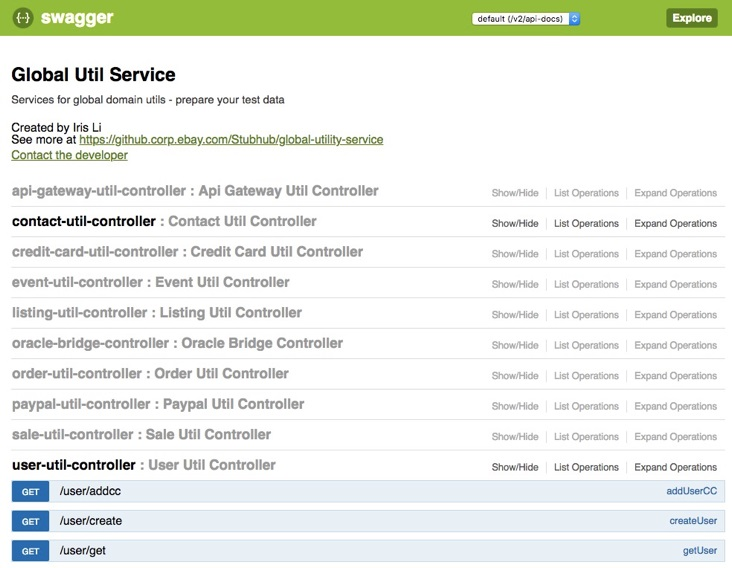

# 测试数据的“银弹”- 统一测试数据平台（下）

在上一篇文章中，我和你分享了测试数据准备 1.0 时代的实践，在这个 1.0 时代，测试数据准备的最典型方法是，将测试数据准备的相关操作封装成数据准备函数。今天，我将继续为你介绍测试数据准备的 2.0 和 3.0 时代的实践，看看创建测试数据的方法，又发生了哪些变革。

在 1.0 时代，为了让数据准备函数使用更方便，避免每次调用前都必须准备所有参数的问题，我和你分享了很多使用封装函数隐藏默认参数初始化细节的方法。

但是，这种封装函数的方式，也会带来诸如需要封装的函数数量较多、频繁变更的维护成本较高，以及数据准备函数 JAR 版本升级的尴尬。所以，为了系统性地解决这些可维护性的问题，我们对数据准备函数的封装方式做了一次大变革，也由此进入了测试数据准备的 2.0 时代。

## 测试数据准备的 2.0 时代

在测试数据准备的 2.0 时代，数据准备函数不再以暴露参数的方式进行封装了，而是引入了一种叫作 Builder Pattern（生成器模式）的封装方式。这个方式能够在保证最大限度的数据灵活性的同时，提供使用上的最大便利性，并且维护成本还非常低。

事实上，如果不考虑跨平台的能力，Builder Pattern 可以说是一个接近完美的解决方案了。关于什么是“跨平台的能力”，我会在测试数据准备的 3.0 时代中解释，这里先和你介绍我们的主角：Builder Pattern。<!-- [[[read_end]]] -->

Builder Pattern 是一种数据准备函数的封装方式。在这种方式下，当你需要准备测试数据时，不管情况多么复杂，你一定可以通过简单的一行代码调用来完成。听起来有点玄乎？没关系，看完我列举的这些实例，你马上就可以理解了。

<b>实例一</b>：你需要准备一个用户数据，而且对具体的参数没有任何要求。也就是说，你需要的仅仅是一个所有参数都可以采用默认值的用户。那么，在 Builder Pattern 的支持下，你只需要执行一行代码就可以创建出你需要的这个所有参数都是默认值的用户了。这行代码就是：

<pre>
UserBuilder.build();
</pre>

<b>实例二</b>：你现在还需要一个用户，但是这次需要的是一个美国的用户。那么这时，在 Builder Pattern 的支持下，你只用一行代码也可以创建出这个指定国家是美国，而其他参数都是默认值的用户。这行代码就是：

<pre>
UserBuilder.withCountry("US").build();
</pre>

<b>实例三</b>：你又需要这样一个用户数据：英国用户，支付方式是 Paypal，其他参数都是默认值。那么这时，在 Builder Pattern 的支持下，你依然可以通过一行简单的代码创建出满足这个要求的用户数据。这行代码就是：

<pre>
UserBuilder.withCountry("US").withPaymentMethod("Paypal").build();
</pre>

通过这三个实例，你肯定已经感受到，相对于 1.0 时代的通过封装函数隐藏默认参数初始化的方法来说，Builder Pattern 简直太便利了。

趁热打铁，我再来和你总结一下 Builder Pattern 的便利性吧：
- 如果仅仅需要一个全部采用缺省参数的数据的话，你可以直接使用 TestDataBuilder.build() 得到；
- 如果你对其中的某个或某几个参数有特定要求的话，你可以通过“.withParameter()”的方式指定，而没有指定的参数将自动采用默认值。

这样一来，无论你对测试数据有什么要求，都可以以最灵活和最简单的方式，通过一行代码得到你要的测试数据。

在实际工程项目中，随着 Builder Pattern 的大量使用，又逐渐出现了更多的新需求，为此我归纳总结了以下 4 点：
- 有时候，出于执行效率的考虑，我们不希望每次都重新创建测试数据，而是希望可以从被测系统的已有数据中搜索符合条件的数据；
- 但是，还有些时候，我们希望测试数据必须是全新创建的，比如需要验证新建用户首次登录时，系统提示修改密码的测试场景，就需要这个用户一定是被新创建的；
- 更多的时候，我们并不关心这些测试数据是新创建的，还是通过搜索得到的，我们只希望以尽可能短的时间得到需要的测试数据；
- 甚至，还有些场景，我们希望得到的测试数据一定是来自于 Out-of-box 的数据。

为了能够满足上述的测试数据需求，我们就需要在 Builder Pattern 的基础上，进一步引入 Build Strategy 的概念。顾名思义，Build Strategy 指的是数据构建的策略。

为此，我们引入了 Search Only、Create Only、Smart 和 Out-of-box 这四种数据构建的策略。这四类构建策略在 Builder Pattern 中的使用很简单，只要按照以下的代码示例指定构建策略就可以了：

<pre>
UserBuilder.withCountry(“US”).withBuildStrategy(BuildStrategy.SEARCH_ONLY.build();
UserBuilder.withCountry(“US”).withBuildStrategy(BuildStrategy.CREATE_ONLY).build();
UserBuilder.withCountry(“US”).withBuildStrategy(BuildStrategy.SMART).build();
UserBuilder.withCountry(“US”).withBuildStrategy(BuildStrategy.OUT_OF_BOX).build();
</pre>

结合着这四类构建策略的代码，我再和你分享一下，它们会在创建测试数据时执行什么操作，返回什么样的结果：
- 当使用 BuildStrategy.SEARCH_ONLY 策略时，Builder Pattern 会在被测系统中搜索符合条件的测试数据，如果找到就返回，否则就失败（这里，失败意味着没能返回需要的测试数据）；
- 当使用 BuildStrategy.CREATE_ONLY 策略时，Builder Pattern 会在被测系统中创建符合要求的测试数据，然后返回；
- 当使用 BuildStrategy.SMART 策略时，Builder Pattern 会先在被测系统中搜索符合条件的测试数据，如果找到就返回，如果没找到就创建符合要求的测试数据，然后返回；
- 当使用 BuildStrategy.OUT_OF_BOX 策略时，Builder Pattern 会返回 Out-of-box 中符合要求的数据，如果在 Out-of-box 中没有符合要求的数据，build 函数就会返回失败；

由此可见，引入 Build Strategy 之后，Builder Pattern 的适用范围更广了，几乎可以满足所有的测试数据准备的要求。

但是，不知道你注意到没有，我们其实还有一个问题没有解决，那就是：这里的 Builder Pattern 是基于 Java 代码实现的，如果你的测试用例不是基于 Java 代码实现的，那要怎么使用这些 Builder Pattern 呢？

在很多大型公司，测试框架远不止一套，不同的测试框架也是基于不同语言开发的，比如有些是基于 Java 的，有些是基于 Python 的，还有些基于 JavaScript 的。而非 Java 语言的测试框架，想要使用基于 Java 语言的 Builder Pattern 的话，往往需要进行一些额外的工作，比如调用一些专用函数等。

我来举个例子吧。对于 JavaScript 来说，如果要使用 Java 的原生类型或者引用的话，你需要使用 Java.type() 函数；而如果要使用 Java 的包和类的话，你就需要使用专用的 importPackage() 函数 和 importClass() 函数。

这些都会使得调用 Java 方法很不方便，其他语言在使用基于 Java 的 Builder Pattern 时也有同样的问题。

但是，我们不希望、也不可能为每套基于不同开发语言的测试框架都封装一套 Builder Pattern。所以，我们就希望一套 Builder Pattern 可以适用于所有的测试框架，这也就是我在前面提到的测试准备函数的“跨平台的能力”了。

为了解决这个问题，测试数据准备走向了 3.0 时代。

## 测试数据准备的 3.0 时代

为了解决 2.0 时代跨平台使用数据准备函数的问题，我们将基于 Java 开发的数据准备函数用 Spring Boot 包装成了 Restful API，并且结合 Swagger 给这些 Restful API 提供了 GUI 界面和文档。

这样一来，我们就可以通过 Restful API 调用数据准备函数了，而且由于 Restful API 是通用接口，所以只要测试框架能够发起 http 调用，就能使用这些 Restful API。于是，几乎所有的测试框架都可以直接使用这些 Restful API 准备测试数据。

由此，测试数据准备工作自然而然地就发展到了平台化阶段。我们把这种统一提供各类测试数据的 Restful API 服务，称为“统一测试数据平台”。

最初，统一测试数据平台就是服务化了数据准备函数的功能，并且提供了 GUI 界面以方便用户使用，除此以外，并没有提供其他额外功能。如图 1 所示就是统一测试数据平台的 UI 界面。

图 1 最初的统一测试数据平台 UI 界面

后来，随着统一测试数据平台的广泛使用，我们逐渐加入了更多的创新设计，统一测试数据平台的架构也逐渐演变成了如图 2 所示的样子。

图 2 演变后的统一测试数据平台架构

接下来，我和你分享一下统一测试数据平台的架构设计中最重要的两个部分：
1. 引入了 Core Service 和一个内部数据库。其中，内部数据库用于存放创建的测试数据的元数据；Core Service 在内部数据库的支持下，提供数据质量和数量的管理机制。
2. 当一个测试数据被创建成功后，为了使得下次再要创建同类型的测试数据时可以更高效，Core Service 会自动在后台创建一个 Jenkins Job。这个 Jenkins Job 会再自动创建 100 条同类型的数据，并将创建成功的数据的 ID 保存到内部数据库，当下次再请求创建同类型数据时，这个统一测试数据平台就可以直接从内部数据库返回已经事先创建的数据。 
   在一定程度上，这就相当于将原本的 On-the-fly 转变成了 Out-of-box，缩短整个测试用例的执行时间。当这个内部数据库中存放的 100 条数据被逐渐被使用，导致总量低于 20 条时，对应的 Jenkins Job 会自动把该类型的数据补足到 100 条。而这些操作对外都是透明的，完全不需要我们进行额外的操作。

这就是测试数据准备的 3.0 时代的最佳实践了。关于这个统一测试数据平台，如果你还想了解更多的技术细节，欢迎你给我留言，我们一起讨论。

## 总结

我和你分享了测试数据准备 2.0 时代的 Builder Pattern 实践，以及 3.0 时代的统一测试数据平台。

2.0 时代的 Builder Pattern 在提供了最大限度的数据灵活性的同时，还保证了使用上的最大便利性，并且维护成本还非常低。如果不考虑跨平台能力的话，Builder Pattern 已经是一个接近完美的解决方案了。

3.0 时代统一测试数据平台，其实是将所有的数据准备函数在 Spring Boot 的支持下转变为了 Restful API，为跨平台和跨语言的各类测试框架提供了统一的数据准备方案。

## 思考题

关于统一测试数据平台，由于引入了 Core Service 和内部数据库，所以可以在此基础上实现更多的高级功能。对此，你觉得还可以引入哪些功能呢？