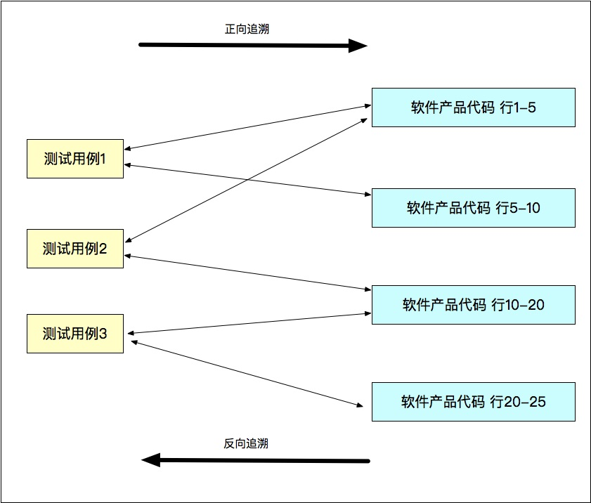

# 打蛇打七寸：精准测试

在前面的两篇文章中，我和你分享了探索式测试和测试驱动开发的概念、具体的实施方法。今天，我会继续和你分享软件测试领域中的另一个前沿话题：精准测试。

软件测试行业从最开始的手工测试到自动化测试，从黑盒测试到白盒测试，测试理念和技术都发生了日新月异的变化。现如今，几乎所有的软件公司都有一套强大且复杂的自动化测试用例，用来夜以继日地保证产品的正确性和稳定性。

然而，你有没有想过，现在你所掌握的软件测试技术和用例，真的是最准确、最适合你的产品的吗？这其中，是不是存在很多冗余的测试数据、根本用不上的测试用例、永远成功不了的测试场景？

更糟糕的是，当产品代码有更新时，你根本不知道这些更新到底影响了哪些功能，也无法精准地选取测试用例，而不得不执行完整的全回归测试。

针对这类问题，精准测试的概念在 2016 年被提了出来。<b>所谓精准测试，就是借助一定的技术手段、通过算法的辅助对传统软件测试过程进行可视化、分析以及优化的过程</b>。也就是说，精准测试可以使得测试过程可视、智能、可信和精准。

为了可以帮助你更好地理解，为什么要有精准测试，以及它可以解决什么问题，我在和你分享精准测试的内容时，会先和你一起分析传统软件测试正面临着哪些痛点，而精准测试又是如何解决这些痛点的。<!-- [[[read_end]]] -->

## 传统软件测试的主要短板

现如今，软件产品的规模以及复杂度的发展速度，可谓超乎想象，而传统的软件测试方法，在面临这些挑战时已经表现出了些许力不从心。这些力不从心，也就是传统软件测试的短板，我归纳为了下面这五大类：

<b>第一大短板，测试的维护成本日益升高。</b>

当传统测试的用例逐渐增加时，需要花费越来越大的时间和人力成本，去维护一个庞大的测试用例集，以此保证产品新特性和老功能的正确性和稳定性。

而在这成千上万的测试用例中，有很多陈旧的用例已经失效了（不再能满足现有产品的测试需求了），但是整个团队还是要花费很多精力去维护这个庞大的测试用例集。

<b>第二大短板，测试过程的低效。</b>

随着软件功能不断丰富，相应的测试用例集也愈加庞大，这时难免会出现“杀虫剂”效应，即：测试用例越来越多，而产品的“免疫力”也越来越强。

造成这种问题的原因是，我们在测试早期已经发现了 80% 的软件缺陷，除非再花费巨大的人力和时间成本去分析和增加大批量的测试用例，否则后期新增的测试用例已经很难再发现新的缺陷了。

而精准测试可以通过对已有测试数据的跟踪分析，来定位或者缩小测试范围，以此减少发现剩下 20% 的软件缺陷的工作量。

<b>第三大短板，缺乏有效的回归用例选取机制。</b>

在传统测试理念中，每次添加新功能或者修复缺陷，一般都需要在产品上线前进行一轮全回归测试，哪怕这次的改动只有一行代码。但是，全回归测试的测试用例数量以及执行代价一般都比较大。

这里，我们之所以要采用全回归测试，是因为我们无法准确地知道这次的更新到底会影响哪些功能，也无法知道应该从回归测试中选取哪些必要的测试用例，无奈之下只能两眼一抹黑地执行全部用例。

<b>第四大短板，测试结果的可信度不高。</b>

在传统的软件测试中，测试数据的统计分析人工因素占据了绝大部分比重，由此导致测试数据本身的技术公信力不够高，进而需要依靠管理手段来保证真实的测试数据被准确地记录。

这种做法不仅可靠性差，而且执行成本高。

<b>第五大短板，无论是白盒测试技术还是黑盒测试技术都有其局限性。</b>

如果完全基于黑盒测试，那么注定无法深入代码实现的细节，也就无法做到有的放矢地设计测试；而如果基于白盒测试技术，为了保证代码质量，往往会采用代码级测试和代码覆盖率技术。

但是，这些测试方法都强依赖于产品代码，一旦代码发生改变，很多测试都会因此失效，因此很难适应高速迭代的开发流程。

另外，由于目前的代码级测试和代码覆盖率技术还不支持测试用例级别的覆盖率分析，而是要将所有测试结果混在一起，导致白盒测试时无法区分代码覆盖率的贡献到底来自于哪个测试用例，这将极大地限制白盒测试工具在测试结果分析上的应用。

## 精准测试的核心思想

而，精准测试便是为了解决传统测试的这些短板。它的核心思想是，借助一些高效的算法和工具，收集、可视化并且分析原生的测试数据，从而建立起一套测试分析系统。

所以，精准测试的主要特征可以概括为以下几个方面：

<b>第一，精准测试是对传统测试的补充</b>。精准测试是基于传统测试数据的，并不会改变传统的软件测试方法，更不会取代传统测试。也就是说，精准测试在不改变原有测试集的基础下，能够优化测试过程和数据，提高测试效率。

<b>第二，精准测试采用的是黑盒测试与白盒测试相结合的模式</b>。在执行黑盒测试时，收集程序自动产生的白盒级别的运行数据，然后通过可视化或者智能算法识别出测试未覆盖的点，继而引导开发人员和测试人员有的放矢地补充测试用例。

同时，在黑盒测试的执行过程中，可以实现测试用例和产品代码的自动关联，将基于黑盒的功能测试直接映射到基于白盒的代码层，这将使智能回归测试用例选取的想法成为可能。

<b>第三，精准测试的数据可信度高</b>。精准测试的数据都是由系统自动录入和管理的，人工无法直接修改数据，因此我们可以直接将传统测试产生的数据导入精准测试系统，用于测试结果的分析，从而使测试结果具有更高的可信度。

<b>第四，精准测试过程中，不直接面对产品代码</b>。精准测试通过算法和软件实现对测试数据和过程的采集，因此并不会直接面向代码，也就不会强依赖于产品代码。

但是，精准测试能够实现测试用例和产品代码的自动关联，也就是说代码覆盖率的统计可以以测试用例为单位来进行，具体实现的核心思想还是基于代码覆盖率的统计，只是在代码覆盖率的元数据上增加了测试用例的信息。

因此，代码的改变并不会影响测试过程，但却能够将功能测试间接映射到代码级别。这样，精准测试就实现了测试用例和被测产品代码的双向追溯<b>。</b>

<b>第五，精准测试是与平台无关的、多维度的测试分析算法系统</b>。精准测试系统是一种通用的测试分析系统，独立于任何测试平台，其内部算法和业务无关，因此适用于各种不同的产品。

同时，精准测试为我们提供了多维度的测试分析算法，拓展了白盒测试的范畴。而，精准测试对测试用例和产品代码的自动关联，使得它可以为测试过程提供大量的智能分析结果。

接下来，我们再一起看看精准测试具体有哪些方法。

## 精准测试的具体方法

目前业界最成熟并且已经产品化的精准测试体系，来自于国内公司“星云测试”。所以，下面关于精准测试的具体方法的分享中，涉及到的很多概念我都参考了其官网的《星云精准测试白皮书》。如果你对完整的白皮书内容感兴趣的话，可以参考[http://www.threadingtest.com/index.html](http://www.threadingtest.com/index.html)。

目前，由星云测试实现的精准测试平台中，核心组件包括精准测试示波器、测试用例和被测产品代码的双向追溯、智能回归测试用例选取，以及测试用例聚类分析这四项最关键的技术。在这其中，最为核心的技术是测试用例和产品代码的双向追溯。

接下来，我会依次和你分享这 4 项核心技术，希望借此加强你对精准测试的理解。

### 软件精准测试示波器

软件精准测试示波器，即在软件测试（人工测试或者自动化测试）的过程中，自动分析代码运行的一些数据指标，并将其用图表的方式实时显示出来。其中，这些数据指标包括了代码的逻辑块执行速率、代码的条件执行速率、函数的调用速率等等。

同时，由于示波器记录了每个测试用例的产品代码执行序列，因此可以通过比较两个测试用例的产品代码执行序列来判断两个测试用例是否隶属于同一个等价类，这将有助于精简测试用例的数量。

另外，由于示波器所有的数据都是通过系统自动导入的，因此不存在人工导入可能引入的数据误差，借此保证了所有数据的分析和显示都是真实且可靠的。

最终，示波器以类似心电图的形状实时显示测试过程中被测代码的运行信息，因此我们可以很直观地看到测试中发生的变化。一旦测试过程稍有异常，就会立刻显示在示波器上，我们通过图形的变化就可以轻易地对平时不可见的程序行为进行分析，并作出判断。比如，是否存在计算密集的区域，是否有不该执行的代码在后台运行等。

### 测试用例和被测产品代码的双向追溯

顾名思义，测试用例和被测产品代码的双向追溯，就是通过一定的技术手段实现测试用例和被测产品代码的双向关联。这样，我们可以通过测试用例追溯到其执行的代码，也可以通过分析代码的功能为测试提供数据。

这里，<b>测试用例和被测代码的双向追溯，包括正向追溯和反向追溯。</b>

其中，正向追溯，即通过示波器将产品代码和测试用例进行自动关联。这个关联，可精确到方法或者代码块级别。而在关联之后，精准测试系统可以显示每个测试用例实际执行的代码。这样，当我们发现软件缺陷时，便可以快速定位出其所在的代码。

反向追溯是指，如果我要关注程序中的某一块代码，那么就可以通过精准测试系统追溯到所有测试这块代码的测试用例。这样，就使得测试数据便于统计和量化，同时测试和开发工程师之间就可以基于测试数据进行交流，为他们的沟通提供更有效的桥梁，降低沟通成本。

这里我画了一张图，来帮助你更好地理解正向追溯和反向追溯的概念。

图 1 测试用例和被测产品代码的双向追溯示意图

总而言之，测试用例和被测产品代码的双向追溯能显著提升测试效率：
- 当我们发现了软件缺陷和错误时，通过这个方法可以迅速定位到有问题的代码逻辑；
- 当出现一些难以复现的缺陷时，这个方法可以帮助我们追溯有问题的代码而无需强行复现。

说到这里，你可能会有一个疑问，双向追溯技术后台一定是采用了代码覆盖率的统计工具，但是这个代码覆盖率统计工具和双向追溯又具体有什么区别和联系呢？

事实上，这两者之间最大的区别，体现在测试覆盖率的统计方式上。传统的代码覆盖率统计工具，会把所有测试产生的覆盖率混在一起，并不具备单个测试用例的覆盖率统计功能；而精准测试中的双向追溯技术，则可以将覆盖率的分析和计算精确到每个测试用例针对的产品代码。

另外，从实际工程的角度来看，传统的代码覆盖率统计工具都是单机运行，然后完成数据的统计，无法有效整合一个团队下多人的测试结果，也不能按照日期累计。而，现如今的双向追溯技术，则支持多人异地测试、整合计算覆盖率等功能。

### 智能回归测试用例选取算法

回归测试，就是在修复了某个错误或缺陷后，再对软件进行测试以确保没有引入新的错误或缺陷。而，智能回归测试用例选取算法便是针对需要执行的回归测试，通过算法得出各个测试用例的权重和优先级，使得在有限的时间和人力下，能够更高效地执行测试用例。
由于精准测试提供了智能算法来自动选取回归测试用例，因此既避免了人工选取回归测试用例时可能存在的测试盲点，也减少了执行回归测试的时间，同时还能够保证计算结果的精确性，大大降低了回归测试的风险。
另外，精准测试中测试用例和被测产品代码的双向追溯性，也使得当有代码变更需要执行回归测试时，可以直接找到具体应该执行哪些测试用例。

### 测试用例的聚类分析

测试用例的聚类分析，是指通过建立测试用例和代码执行的剖面关系，实现对测试用例的聚类分析。这个聚类分析的结果，将以两维数据呈现出来，即：测试用例 ID 及其对应的代码执行剖面。
通过聚类数据，我们可以很容易地发现测试用例的执行错误。比如，测试用例 A 应该执行代码块 A，而通过聚类分析，我们发现用例执行完被分在了代码块 B 上。因此，我们就可以断定该测试用例发生了错误或者测试环境出现了问题。
同时，测试用例的聚类分析能够展示测试用例的分布情况，为我们调整测试用例的分布提供依据。也就是说，我们可以通过这个数据，对测试用例聚集较少的区域予以补充丰富，同时也可以在测试用例聚集丰富的区域内提取出相对重要的用例，然后执行，从而节省时间、提高测试效率。
精准测试的概念和理论体系虽然比较完善，但就目前来看实际落地的案例还比较少。有些公司可能并不会直接去使用星云测试的平台，而是会基于精准测试的理念和方法去开发自己的工具。比如，有些国内互联网公司，就自己实现了基于增量的代码覆盖率统计方案，以及具有双向追溯功能的代码覆盖率方案。

## 总结

在今天这篇文章中，我和你分享了传统软件测试的方法、理念，因为测试用例数量持续增加而导致的用例维护成本高、测试过程低效、缺乏有效的回归测试用例选取机制等等一系列的问题，而有些力不从心。于是，精准测试应运而生了。
可以说，精准测试是通过一系列的智能算法和技术实现了对测试过程的管理。它可以在测试运行时，分析源数据指标以指导传统测试，并在一次次的修正中大幅提升测试效率。并且，精准测试在测试过程中产生的海量精准数据，即使不在测试周期里，也可以进行分析和追溯，让测试变得更加高效和有价值。
所以说，精准测试在节省了人力成本的同时，保证了软件的质量。

## 思考题

在这里，我并没有和你分享精准测试的所有概念，但是我建议你可以仔细阅读一下星云测试的《精准测试框架白皮书》。然后，你可以再思考一下，还有哪些项目和产品更适于开展精准测试。
如果你还有任何关于精准测试的疑问，欢迎给我留言一起讨论。